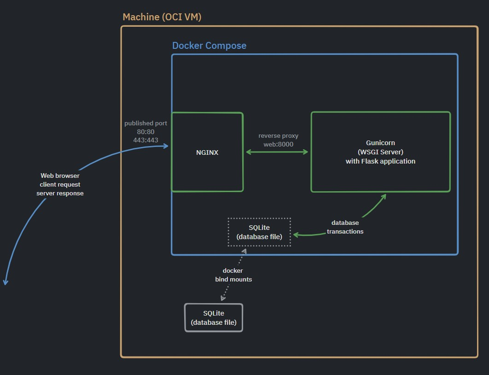

# pyduck

 
 

## What is **pyduck**?

---

pyduck is the commnuity platform for pythonist(any programmer who like coding with Python). pyduck's purpose is to provide joyful space to talk and share knowledge about python and growing each other!!

 
 

## What pyudck provide for users

---

- Q&A
- Talk about life of programmer
- Profile management

 
 

## What pyudck can't provide for users (until now)

---

- Realtime chat
- Interactive python online playground
- ... and many others

 
 

## Architectures

---

 
 

## Tech Stack

---

 

**Server side** 

- language: Python
- webframework: Flask
- ORM/DB mapper: SQLAlchemy/Flask-Sqlalchemy
- Database: SQLite

 

**Client side**
- html/css/(minimal) javascript
- htmx for ajax
- alpine.js for adding tiny interactivity
- bootstrap 5 for minimal UI

 

**Others**
- Web server: nginx
- WSGI server: gunicorn
- Cotainerization: docker/docker compose
- Version control: git/github

 

## License and others

---

 

- License: MIT 2.0
- Commercial: Non commercial